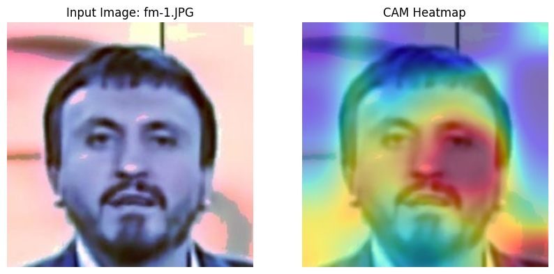

# Deep Fake Detection with EfficientNet
This project fine-tuned a pre-trained model to detect deep fake images.

["deepfake_detection.ipynb"](deepfake_detection.ipynb) is the training code.

["deepfake_detection_testing.ipynb"](deepfake_detection_testing.ipynb) is the testing code.

["Final Project.ipynb"](Final%20Project.ipynb) is the final report, which includes comparisons between our project and other projects and some visualizations.

We also used Explainable AI techniques to interpret how the model classifies the images.

The above images are classified as fake images because of the right side of the face.

More detailed examples are shown in ["Final Project.ipynb"](Final%20Project.ipynb).
